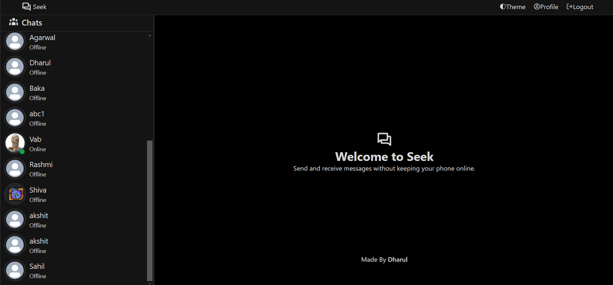
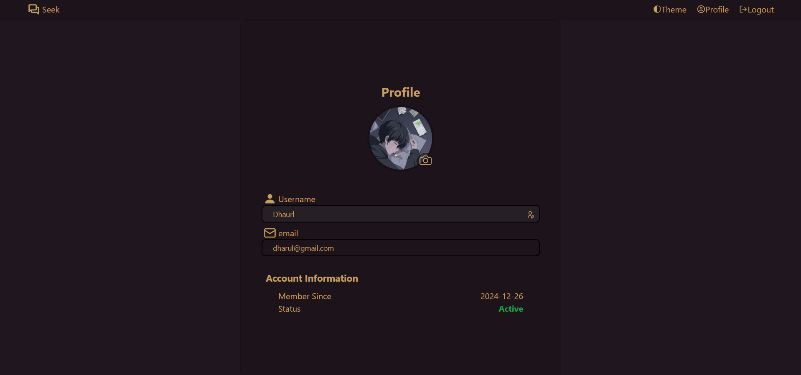
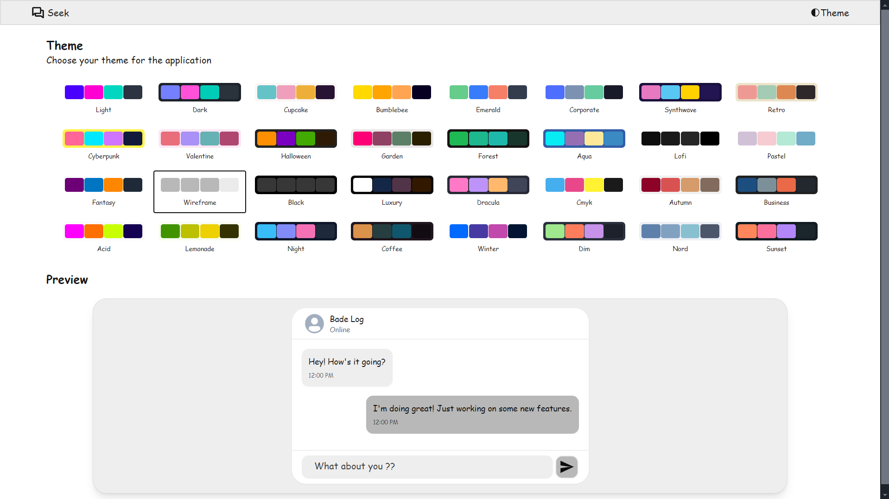
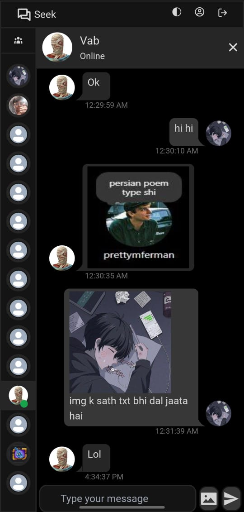

# Seek Application

Seek is a full-stack web application designed to provide users with a seamless and secure experience to chat with each other. The application offers responsive design, user authentication, and dynamic data handling.

## Features

- **User Authentication**: Secure login functionality to protect user data.
- **Responsive UI**: Optimized for various screen sizes using Tailwind CSS.
- **Dynamic Frontend**: Built with React.js and Vite for fast and interactive user experience.
- **Secure Backend**: Node.js and Express.js powering RESTful APIs for data management.
- **Continuous Deployment**: Deployed on Vercel for seamless updates and scalability.

## Technologies Used

- **Frontend**: React.js, Vite, Tailwind CSS
- **Backend**: Node.js, Express.js
- **Version Control**: Git, GitHub
- **Deployment**: Vercel, Railways

## Installation

1. Clone the repositories:
    ```bash
    git clone https://github.com/DharulMittal/Seek-Frontend
    git clone https://github.com/DharulMittal/Seek-Backend
    ```

2. Navigate to each directory and install dependencies:
    ```bash
    cd Seek-Frontend
    npm install

    cd ../Seek-Backend
    npm install
    ```

3. Set up environment variables:
   - Create a `.env` file in the `Seek-Backend` directory with the following variables:
     ```env
     PORT=5000
     MONGO_URI=your_mongodb_connection_string
     JWT_SECRET=your_jwt_secret
     ```

4. Run the development servers:
    ```bash
    # Frontend
    cd Seek-Frontend
    npm run dev

    # Backend
    cd ../Seek-Backend
    npm start
    ```

5. Open the application in your browser:
    ```
    # Frontend
    http://localhost:5173 

    # Backend
    http://localhost:5000      (set port in env)
    ```

## Live Demo

Check out the live version of the application [here](https://seek-nine.vercel.app).

## Screenshots





<!--  -->


## Future Enhancements

- Add more advanced task management features.
- Implement user profiles and settings.
- Integrate push notifications for task reminders.

## Contributing

Contributions are welcome! Please follow these steps:

1. Fork the repository.
2. Create a new branch:
   ```bash
   git checkout -b feature-branch-name
   ```
3. Make your changes and commit:
   ```bash
   git commit -m "Description of changes"
   ```
4. Push to your forked repository:
   ```bash
   git push origin feature-branch-name
   ```
5. Open a pull request on the main repository.

## License

This project is licensed under the MIT License. See the [LICENSE](LICENSE) file for more details.

